# Automatic Waste Sorting System
My project provides an effortless solution to deciding whether trash should thrown away or recycled. Through the use of AI scanning, a Raspberry Pi figures out exactly what kind of trash you are holding, and opens the corresponding wastebasket. 


<!---Replace this text with a brief description (2-3 sentences) of your project. This description should draw the reader in and make them interested in what you've built. You can include what the biggest challenges, takeaways, and triumphs from completing the project were. As you complete your portfolio, remember your audience is less familiar than you are with all that your project entails!-->

<!---You should comment out all portions of your portfolio that you have not completed yet, as well as any instructions:-->

<!---# !!!!edits needed
**Replace the BlueStamp logo below with an image of yourself and your completed project. Follow the guide [here](https://tomcam.github.io/least-github-pages/adding-images-github-pages-site.html) if you need help.**-->

# Final Milestone

<iframe width="560" height="315" src="https://www.youtube.com/embed/mXxHEJFORzs?si=5PXfBaCRD7nCJeey" title="YouTube video player" frameborder="0" allow="accelerometer; autoplay; clipboard-write; encrypted-media; gyroscope; picture-in-picture; web-share" referrerpolicy="strict-origin-when-cross-origin" allowfullscreen></iframe>

## Milestone Overview

Wiring work and CAD for the trash bins and electronics case, and 3D printing the parts

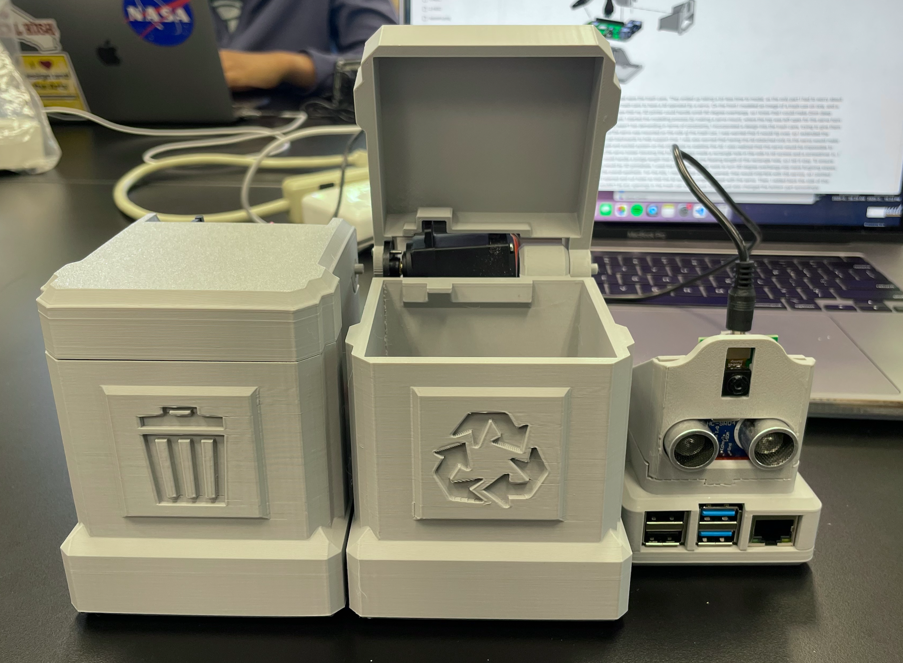

  I used Onshape to design 3D models for my project. I used reference models from GrabCAD to get the dimensions of the electronics, and then modeled around them. I incorporated the Raspberry Pi, ultrasonic sensor, fan, power jack, camera, and all the circuitry into one case. 
  I also re-soldered the wires to shorten their length to make them fit better in the case. Then, I designed two trash bins, one with a trash symbol and the other with a recycling symbol, and a lid and hinge for the servos to actuate. Because of the innacurate dimensions, I had to reprint the lids.

## Technical Progress
### Shortening the Wires
  For every wire that wasn't going out to the servos, I shortened their length by cutting them in the middle, stripping the rubber covering of the ends of the wires, and soldering the wires back together. I did this to reduce chances for the wires to tangle as I was rewiring the circuits to fit through the hole in the 3D printed case I had designed.

### CAD Work
  For the electronics case, I started with designing a compartment for the Raspberry Pi. One of the main challenges was to make something that was both possible to 3D print with minimal supports and possible to assemble. I took a Raspberry Pi 4B model off of GrabCAD and designed the lower part of the case around it. I also incorporated holes where a USB-C cable and an HDMI cable could be plugged in, giving power to the Raspberry Pi. I also added vents on both sides for the fan. I was going to mount on the lid, so that air could get out of the closed box. I made the lid a separate part that could be screwed on to the bottom frame, so that I could put the Raspberry Pi in first during assembly. 
  
  On the lid part, I made a socket where it could hold the breadboard, wire ports for the jumper wires and ribbon cable, and a holder for the DC powerjack, which powers the other components. To cool the whole system, I made an area where a 5V fan could be mounted at a slanted angle to cool the area without getting in the way of components mounted on the main face of the lid. 
  
  The DC powerjack was an interesting part of the design because it had no screw holes to attach to anything, so I had to design in a two part clamp to hold it in place, with one part of it attached to the lid, and the other as a screw-in holder which tightened on the powerjack, holding it in place. I also designed screw ports to hold more parts. Because of the limitations of assembly and 3D printing, I made the sensor mount and wire cover two seperate parts. The sensor mount had a hole for the round parts of the ultrasonic sensor to stick out of, securing it. The wire cover was designed at a 30% incline to combat the fact that 3D printers cannot print horizontally or close to that angle.

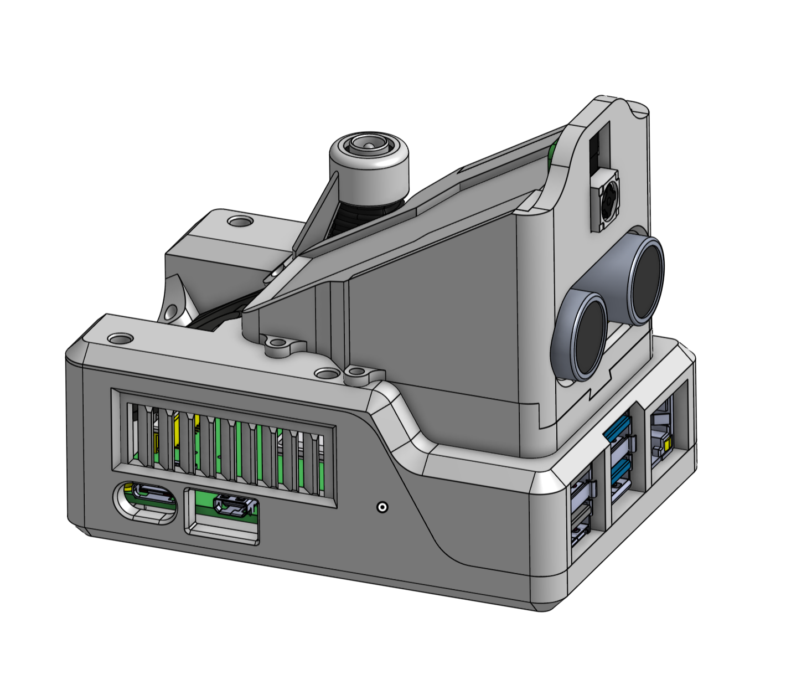
Electronics Case
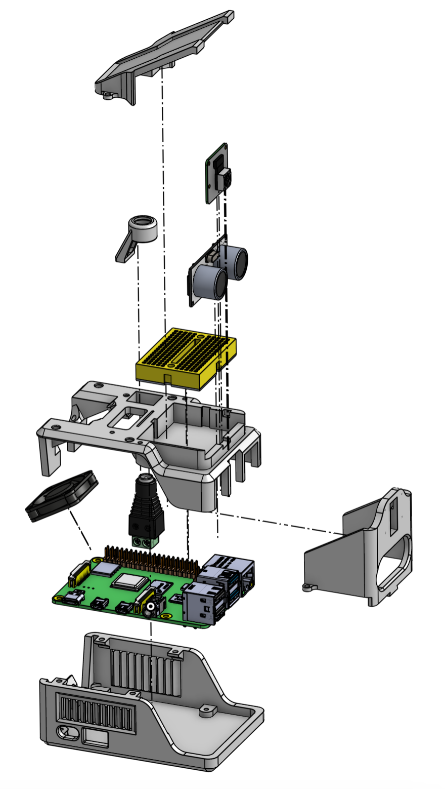

  The next thing that I had to model were the trash cans. They ended up taking a lot less time to model, as the only part I had to worry about were the servos. On the front, I modeled an image of a trash can on one, and a recycle symbol on another. I knew that my 3D printer could handle small 90 degree overhangs, so I knew that I could make 2mm deep symbols without too many issues. I started the modelling process by making a servo mount, where the top was left open for the servo horn to interact with lid. Because it wasn't too demanding in terms of constraints, I incorporated a design into the trash cans, trying to give them a futuristic look. 
  
  Because the servo was mounted on the side of the trash can, I was worried that it would tip over, so I extended the bottom edge of the trash can backwards to help support that. I was also worried that having the lid attached only to the servo would make it wobble, so I added an axle and socket system on the other side to stabilize the lid. I also realized that the servo would be impossible to screw in sideways due to the servo holder blocking the holes, so I also made a rectangle hole in the side to let screws and a screwdriver in. I knew that my 3D printer could handle a bridge length that was similar to the floating length of the rectangle hole, so I let it stay. To ensure that the other overhangs would be 3D printabale, I used the fillet and chamfer tools to turn 90 degree overhangs into more forgiving slopes that also contributed to the overall aesthetic. 
  
  For the lids, I realized that as they opened, they would interfere with the servos, so I plotted the motion of the lid as it opened and cut holes so that the lid would no longer interset with the servo. Then, I added back the side of the trash can so that there wouldn't be any openings in the trash can when it was closed, and also changed the bottom part accordingly.

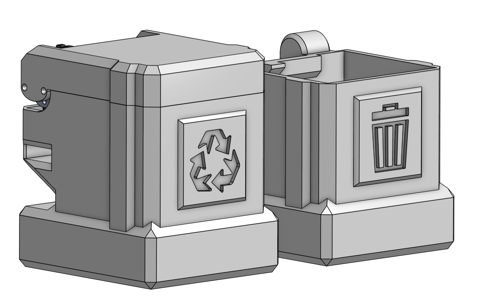
Garbage Bins
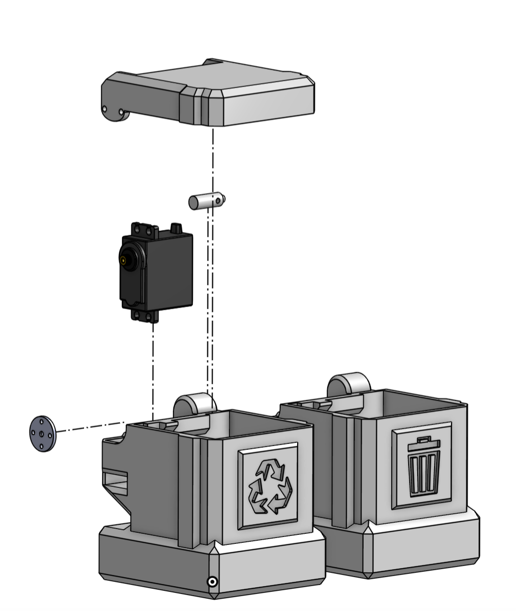

### 3D Printing
  My parts were printed on a Bambu Lab A1, an open air bedslinger printer, using gray PETG. During the design, there was a tradeoff of printing with support material and using more screws. One would be more wasteful, as printing with support material increases print time and makes waste each time the filament changes back to the other one, but the other would be harder to assemble and would look uglier. As a result, the lid was printed with supports and support material, which I thought was the best option because of the amount of functions it had to serve, such as hold all the external components, along with the breadboard. I had to print 5 parts for the electronics case, which took about 5 hours in total, split between four different prints. I had to reprint the bottom Raspberry Pi mount

  My next task was to print the two trash cans, the lids, and their lid axles. I printed them all at once for an overnight print, which used 300g of PETG and came scarily close to using all the filament, which would've stopped the print midway. The print ended up taking about 9 hours, all at once. As expected the print did deteriorate in quality when printing the 90 dergee overhangs, but it was in a way that was acceptable and had little effect on the function of the print as a whole. Due to the printer being open air, there was some warping of the bottom layers, but the built-in chamfer of the lower part of the trash can made it invisible when viewed from above. Warping happens when the plastic cools unevenly and center pulls on the outside edges, causing them to lift off the build plate and cause warping. I had my prints warp before, and after cleaning my build plate the warping became less severe.

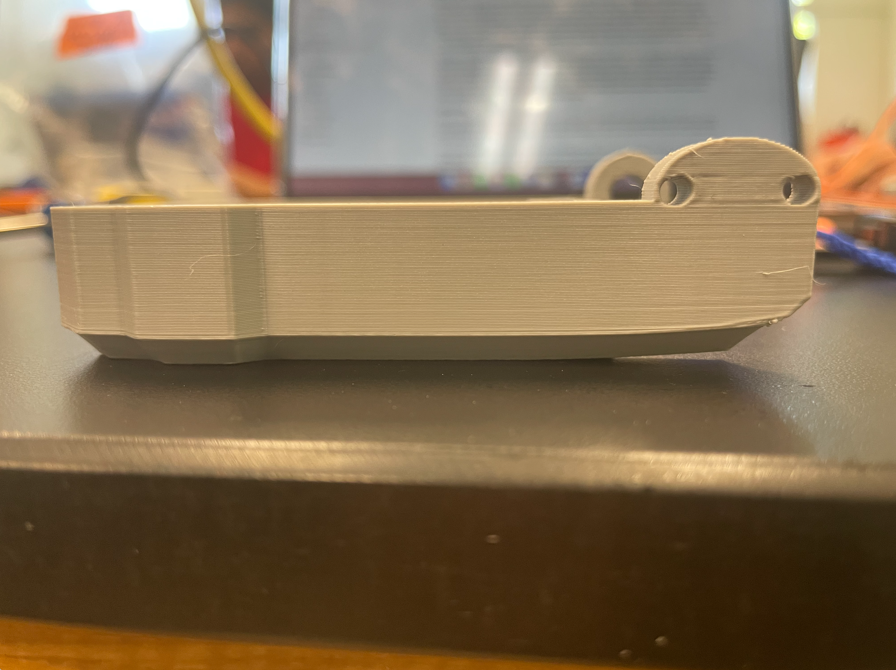
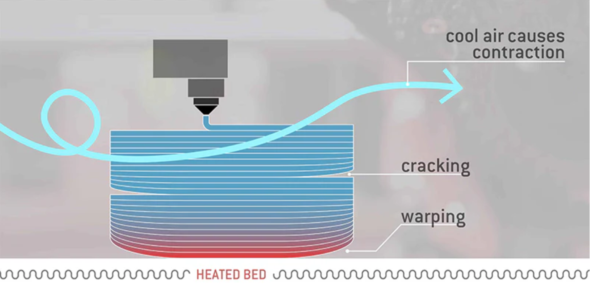

### Assembling
  I designed my model to use three different types of screws. The fan and bottom plate were attached to the lid with m3 screws, or screws with a major diameter of 3mm. Every other part was attached with m2.5 screws, where the parts were smaller and it would be hard to put larger screws or screw holes. The one exception was the wire cover, where the cover was too thin for the m2.5 screws, so I ended up using an m1.5 screw to secure it in place.

  The wires were especially hard to assemble, even with all the design choices I made to try and make the wires easier to assemble. Because I condensed the wires beforehand, it made the connections much shorter and tighter. I had the breadbaord in a compartment and all the wires were threaded through a port on the lid onto the GPIO pins on the Raspberry Pi. This means I had to connected the breadboard wires to the Raspberry Pi with a lid in the way of everything. The wires ended up coming loose many times, and I had to go back, unscrew everything, and retry it. The ribbon cable was also getting very compressed due to the fact that I could not shorten in, which ended up making it lose signal with the camera. I had to rearrange many of the wires to find an orientation where it worked.

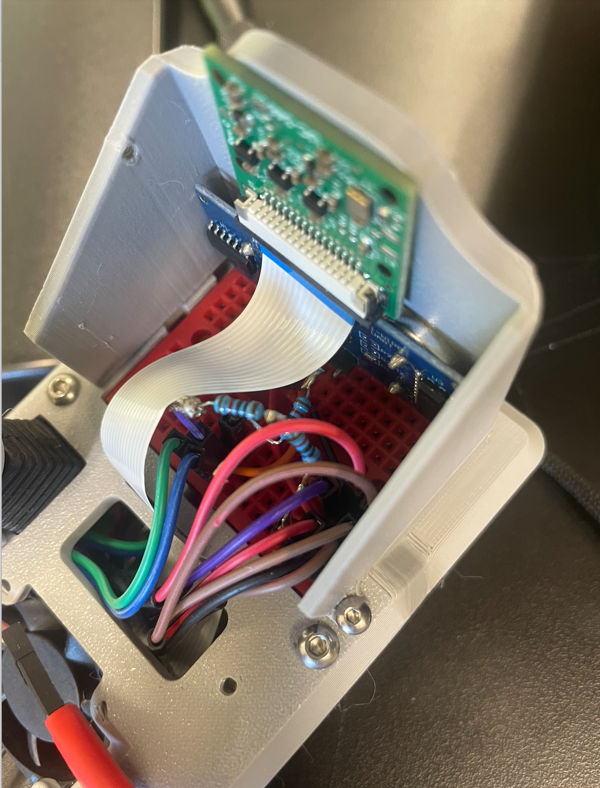

  Another assembly challenge was the 5V fan. The wires themselves were unnaturally short, and because it was mounted from the inside, It was very difficult to position the screwdriver in a way that would screw in the fan without disconnecting the wires.

  When attatching the camera, I realized that there were no m1 screws to be found, and anyways the holes were at such a tight tolerance that they closed up. In the end, I let the camera sit in the socket and secured it purely by the tension of the camera.

  In contrast, assembly of the lid and trash bin went on without issues.

## Challenges
The main challenge of CAD and design is trying to satisfy all the design requirements at once, all while making the design look somewhat good. I ensured that my design had:
-max overhang of 60 degrees
-max bridge length of 10mm
-decent durability with a minimum wall thickness of 2mm
-flat surface to print on without supports
-physically possible to be assembled once printed

  Another challenge that I had was related to the lids of the 3D printed trash bins. Due to a faulty GrabCAD model, My lid's clearances were completly innacurate. The space in between the two sections was too narrow so it couldn't fit onto the bin at all. Additionally, the clearances I had left out for the servos were completley off, so even if I had sanded down the attatchment points on the lid, It wouldn't even be possible to open. To fix this, all I could really do was to measure out the mistakes and reprint the lid so that it could work.

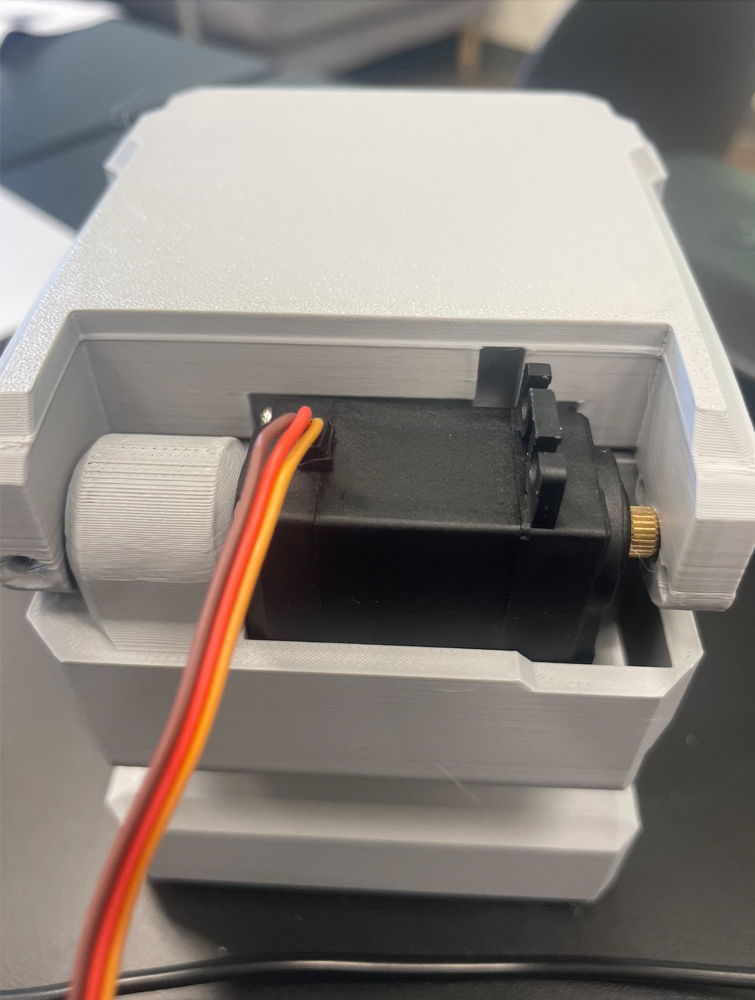
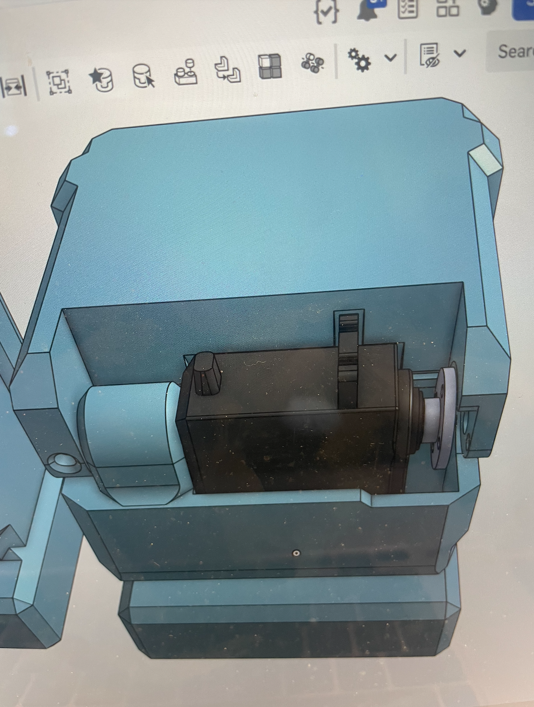

  Assembly of the electronics case proved to be challenging. I designed it to be as compact as possible so that it would take up the least amount of space needed, which resulted in the wires getting pressed together, and occasionallly coming loose, forcing me to go back, take off the lid, rewire everything, and then screw it back on. I did this a few times before everything finally worked. Later on, I also had an issue with the resistors on the circuit board. I tried to replace the old ones, which my instructors said were weird because I had soldered redudant joints onto them, but when I tried to replace the resistors, my ultrasonic sensor broke down. Only the old ones worked, so I left it at that.

  Another issue I had related to design was the servo wires. I had forgot to make ports for the servo wires out of the electronics case. Since I didn't want to redesign and reprint something new, I ended up snapping off the wall that covered the distance from the fan to the base so that I could port the wires out from the back.

## Lessons Learned
  I learned that online models can often contain innacuracies. For example, the GrabCAD model for the servos was outrageously innacurate. I ended up having to measure them myself in order to fix the issue. This also helped me realize that the only real way to make sure something is perfect is to test that it works in person, with all the parts at hand. On the CAD software, you cannot account for part durability, accuracy, tolerance, and it is sometimes very hard to spot unwanted intersections that can ruin part of a model. I was lucky that my electronics case went well without much issues, and although the trashcan lid not fitting was a GrabCAD error, it was also my fault for trusting the model completley and not doing measurements of my own.

# Second Milestone

<iframe width="560" height="315" src="https://www.youtube.com/embed/9-2GtGsHa2s?si=hfRwwB2-s6Nt2tqi" title="YouTube video player" frameborder="0" allow="accelerometer; autoplay; clipboard-write; encrypted-media; gyroscope; picture-in-picture; web-share" referrerpolicy="strict-origin-when-cross-origin" allowfullscreen></iframe>
  
## Milestone Overview
I trained an AI on different kinds of trash, and coded the sensors and scanning system.

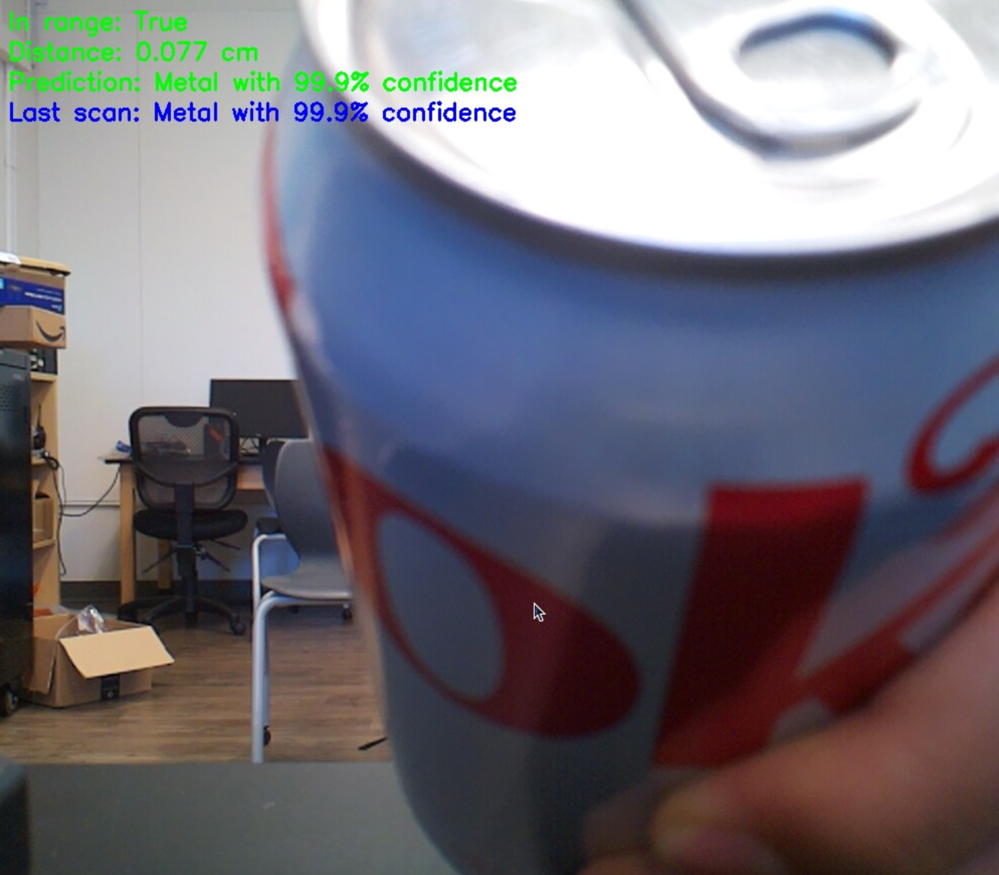

  I trained a machine learning model to detect different kinds of trash by selecting good training images from various datasets. Then, I modified a script for running the Tensorflow Lite model on the Raspberry Pi into my own code. I added two servos and an ultrasonic sensor along with a voltage divider circuit and wired it to a breadboard, and made a script that scans trash objects within range of the ultrasonic sensor.

## Technical Progress
### Training a Machine Learning model
  After trying out a premade model, I used Teachable Machine to generate a Machine learning model that could detect the kind of trash that was being held in front of the camera. To get good results, I had to painstakingly select 200 images from 5 datasets for each category of trash. Then, I modified the epoch number to prevent the AI model from being overtrained, and after a lot of tweaking the settings I finally got a decent machine learning model.

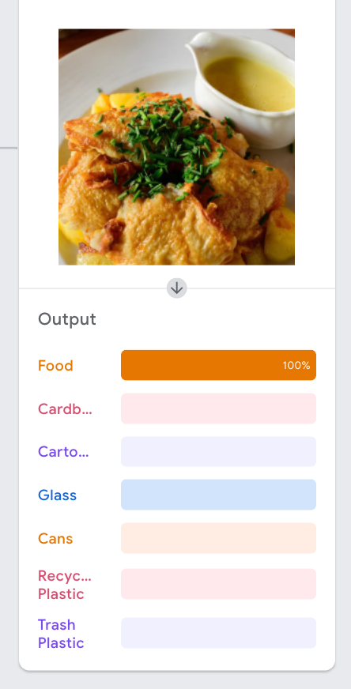

### Getting the Machine Learning model onto the Raspberry Pi
  I uploaded the file into a brand new Python virtual environment to isolate it from the mess I made in the other ones, and then used the SCP command to transfer the ML model to the Raspberry Pi. I then used code from my instructor to display the camera's input as a screen and also show the output of the model on the screen.

### Wiring the electronics
  I wired a 5V power source to a small breadboard to provide a 5V power supply to the ultrasonic sensor and the two servos. Then, I made a voltage divider circuit out of three 10KΩ resistors so that the Ultrasonic sensor could send 3.3V signals back to the Raspberry Pi through the GPIO(General Purpose Input/Output) pins. I also wired the servo signal pins to the GPIO pins and wired the voltage pins to the 5V power supply. Additionally, I re-soldered the wires going between the breadboard and GPIO pins on the Raspberry Pi to reduce their length.

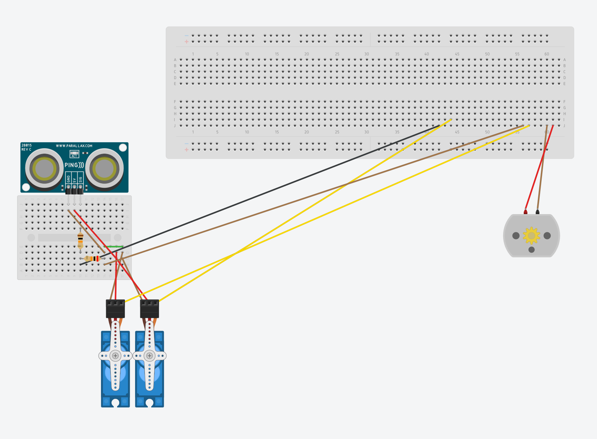
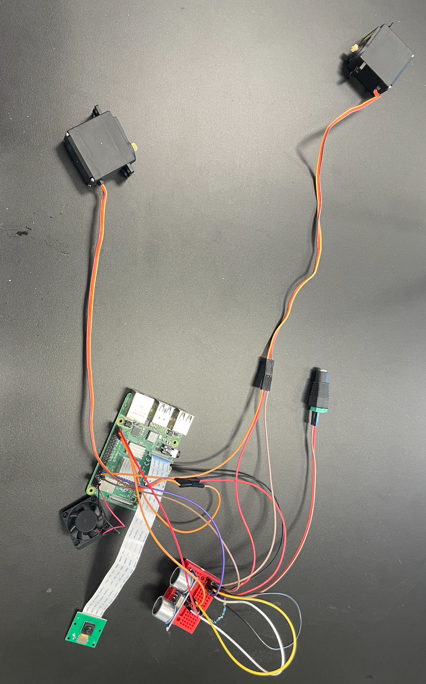 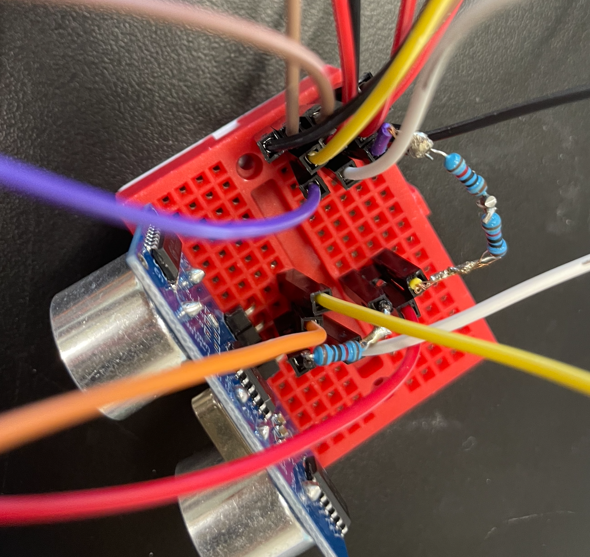


### Scripting the electronics
  I made my script by modifying the script from my instructor that took images, displayed them, and ran them through the machine learning model. I added packages for the servos and ultrasonic sensors so that they could work. To prevent the servos from jittering when they held angles, I made a function that set the angle of the servo through manual pulse width modulation. My script scans the object in front of it 50 times only if it is within range, and then runs it through my custom AI model. Then, based on what the model returns, it will move either the servo that operates the trash can lid or the recycle bin's lid. I also added some text on the UI(User Interface) to show the status of the electronics. I put all of this on a flowchart, which I then coded onto my Raspberry Pi.

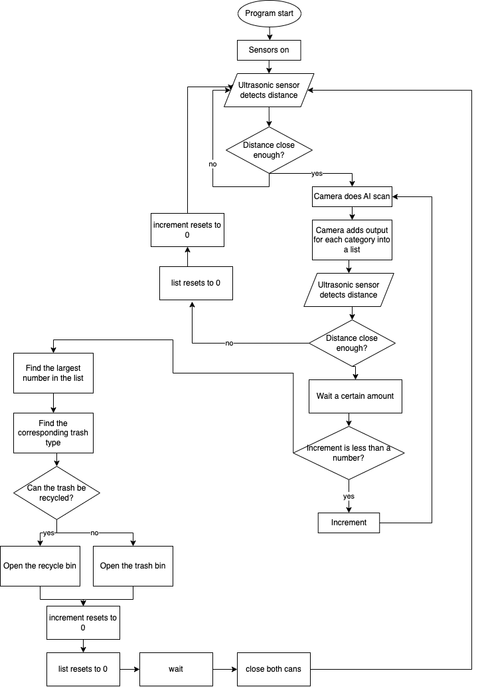

## Challenges
  The biggest challenge that came with this project was getting the custom model of Tensorflow Lite to run on the Raspberry Pi without issues. I thought it would be simple but it ended up taking an excessive amount of time. The premade Tensorflow Lite model's package was practically impossible to edit and insert new models into, so I had to find another way to make it. I tried many tutorials but none of them worked, and in the end we realized that Tensorflow Lite was no longer supported and nothing would run on the current version. Even the tutorial supplied by Adafruit, the one who made the project kit, ended up not working. In the end, I had to use a program made by my instructor in order to get my machine learning model up and running on the Raspberry Pi.

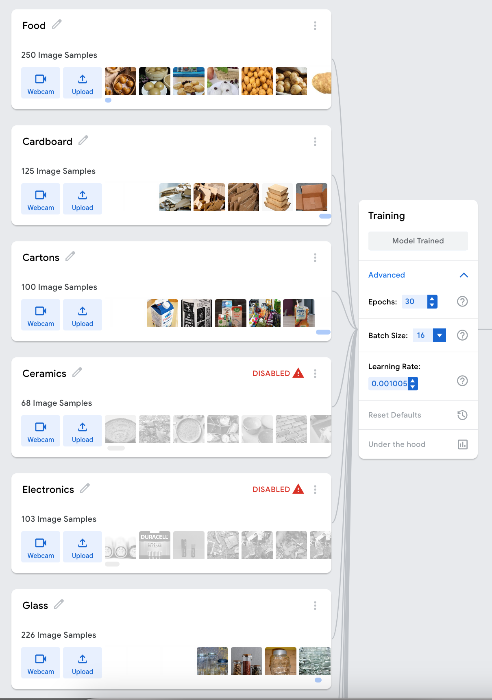

  Another challenge that I had was trying to train the machine learning model. The issues mostly came from having horrible test samples, which had irrelevant subjects and confusing or repetitive backgrounds. Even after training the AI on thousands of images, it was still hopelessly bad. To fix this, I manually searched the database and hand-picked 200 images for each category that I thought were better for the AI model. I also disabled and merged categories that were either irrelevant, like electronic waste, or confusing to tell apart, such as cardboard and wood.

## Lessons Learned
  I learned many lessons throughout this process, but one of the most important ones was the importance of doing research on whatever you are doing. I spent a lot of time and effort trying to get the custom model to work on the Raspberry Pi, only for the tutorial that supported it to be completely outdated. This could have been avoided if I had done slightly more research on the subject and found a better program to run the model on.

  Another lesson that I learned was about electronics and wiring. I about the importance of resistors, and how having the wrong voltage could have devastating consequences. I learned about how a voltage divider circuit works, which uses two resistors and outputs a voltage that is a set fraction of the input voltage, which I used for my ultrasonic sensor. I also learned that voltage always has to go to zero at the end of the circuit, or the "ground". When choosing the right power supply for my servos, I learned about current and how different servos drew different amounts of current, which dictated what power supply I had to use.

## Next Steps
  After this milestone, my plan is to CAD an enclosure for the Raspberry Pi and all the main electrical components, and then to CAD two trash bins and the lids for the servos to actuate them. My third milestone is essentially the completion of my project.

# First Milestone

<iframe width="560" height="315" src="https://www.youtube.com/embed/dWyWQxh6dHo?si=aaolCBvaJNcAtCRP" title="YouTube video player" frameborder="0" allow="accelerometer; autoplay; clipboard-write; encrypted-media; gyroscope; picture-in-picture; web-share" referrerpolicy="strict-origin-when-cross-origin" allowfullscreen></iframe>
<!---
For your first milestone, describe what your project is and how you plan to build it. You can include:
- An explanation about the different components of your project and how they will all integrate together
- Technical progress you've made so far
- Challenges you're facing and solving in your future milestones
- What your plan is to complete your project
-->

## Milestone Overview
Setting up the Raspberry Pi and getting it to run a premade TensorFlow Lite model

  For this milestone, I set up the Raspberry Pi to be able to be controlled by my computer. I also connected a VNC to the Pi so that I could access the camera and file directories easier. Then, I installed everything required for the Tensorflow Lite model to work, and inserted the model onto the Raspberry Pi. My system now can detect items held up to the camera, including water bottles, laptops, and sweatshirts.

## Technical Progress
### SSH-ing into the Raspberry Pi
When flashing the SD card for the Raspberry Pi, I set the hostname and login for the Raspberry Pi so I could SSH into it. I set up a way to quickly access the Raspberry Pi host without needing to run a complicated set of commands using Visual Studio Code. 

<a href="https://www.thingbits.net/products/raspberry-pi-4-model-b-with-2gb-4gb-8gb-ram"> Source </a> 


### Setting up the VNC
The VNC lets me access the camera through the command ``` libcamera-hello --timeout 0``` and lets me operate the Pi through PiOS. To set this up, I installed TigerVNC, which lets me SSH onto the Raspberry Pi, but more importantly, lets me view and edit all the files and confirgurations of the Pi easily.

### Installing Dependencies
To run Tensorflow lite, many dependencies need to be installed. These include ``` python3-pip ```, ```python3-setuptools```, ``` python3.11-venv ```, ``` python3-numpy```, ``` python3-pillow```, ``` python3-pygame```, ``` python3-picamera2 ```, ``` festival ```, and many more. 

### Integrating a premade Tensorflow Lite model
To run the Tensorflow Lite model, I ran several lines of commands in order to start up the camera and the interface. I tested it on multiple objects to confirm that it worked, and it did.

## Challenges
The first main challenge that I encountered was an error with this piece of code:
```
cd ~
sudo pip3 install --upgrade adafruit-python-shell
wget https://raw.githubusercontent.com/adafruit/Raspberry-Pi-Installer-Scripts/master/raspi-blinka.py
sudo python3 raspi-blinka.py
```
  Whenever it was run, it threw me an error related to not having ```adafruit_shell``` installed. I thought it might have had some issues related to the dimensions that we installed, but when I checked, the dependency was already installed. However, the error still persisted. In the end, I just ignored this error and nothing more came of it. Although unsolved, the milestone was still completed.

The second challenge that I had to address was running this piece of code:
```
cd ~
source env/bin/activate
git clone --depth 1 https://github.com/adafruit/rpi-vision.git
cd rpi-vision
pip3 install -e .
```
  The first error it threw me was that the directory ```env/bin/activate``` did not exist, and that was because my directory was named differently. The next error was that ```rpi-vision``` did not exist. This was related to the camera connection itself, because I was also no longer able to ping the camera. However, once I power-cycled the Pi and unconnected and reconnected the camera, the error dissapeared. This then let me install the Tensorflow Lite program.

## Lessons learned
  A major lesson that I learned was about virtual environments. Raspberry Pi refuses to install packages and dependences without created a "venv", which acts as a codespace isolated from updates which could potentially harm the code. Oftentimes the code broke because I wasn't in a virtual environment, or was in the wrong one.

  Another lesson that I learned was related to directories. The change directory, or ```cd```, lets me change between directories, and ```cd ~```returns me to the root directory. When running the Tensorflow Lite model, I often ran it in the wrong directory, which lead to the terminal thowing me an error.

## Next steps
  The next step for my project is to integrate my own Tensorflow Lite model from Teachable Machine onto the Raspberry Pi. This way I can learn how to add my own custom objects to be detected by the Raspberry Pi. I can also improve on the quality of the current model by training it more on the Teachable Machine website.

# CAD Models
<a href="https://drive.google.com/drive/folders/1im89rB-73-HOJeIZ_mWC03cHX8bC5fyC"> Google Drive Link </a>

# Bill of Materials

| **Part** | **Note** | **Price** | **Link** |
|:--:|:--:|:--:|:--:|
| Raspberry Pi 4B | Processing | $64.99 | <a href="https://www.amazon.com/Raspberry-Model-2019-Quad-Bluetooth/dp/B07TC2BK1X/"> Link </a> |
| Camera and Ribbon Cable | Gathers Visual Data | $6.99 | <a href="https://www.amazon.com/Arducam-Raspberry-Camera-Module-1080P/dp/B012V1HEP4/"> Link </a> |
| 5V Brushless Fan | Active Cooling | $4.99 | <a href="https://www.amazon.com/Easycargo-Raspberry-30x30x7mm-Brushless-30mmx30mmx7mm/dp/B0794TXK2W/"> Link </a> |
| 2x MG995 Servos | Actuates lid | $14.69 | <a href="https://www.amazon.com/SIPYTOPF-Digital-Helicopter-Airplane-Control/dp/B0BNYMW9S9/"> Link </a> |
| 170 Pin Breadboard | Circuitry | $5.99 | <a href="https://www.amazon.com/VKLSVAN-Solderable-Breadboard-Tie-Points-Breadboards/dp/B0CLYCZGN3/"> Link </a> |
| HC-SR04 Ultrasonic Sensor | Distance Detection | $6.72 | <a href="https://www.amazon.com/HC-SR04-Ultrasonic-Distance-Measuring-MEGA2560/dp/B088BT8CDW/"> Link </a> |
| 3x 10KΩ Resistors | Voltage Divider Circuit | $3.99 | <a href="https://www.amazon.com/California-JOS-Carbon-Resistor-Tolerance/dp/B0BR68QQPF/"> Link </a> |
| Jumper Wires | Electronic Connections | $3.99 | <a href="https://www.amazon.com/California-JOS-Breadboard-Optional-Multicolored/dp/B0BRTHR2RL/"> Link </a> |
| Breadboard Wires | Breadboard Connections | $8.99 | <a href="https://www.amazon.com/560pcs-Breadboard-Jumper-Wires-Kit/dp/B0F26V7VY2/"> Link </a> |
| DC Barrel Jack Adapter | 5V Power Supply | $1.89 | <a href="https://www.amazon.com/Female-2-1x5-5MM-2-5x5-5MM-Connector-5-5x2-1/dp/B0B7KG6FVH/"> Link </a> |


# Project Code (Headed)
```python3
#Input: Camera and Ultrasonic Sensor
#Output: Servo 0 and Servo 1

#camera packages
from picamera2 import Picamera2
import cv2
import numpy as np
from tflite_runtime.interpreter import Interpreter # type: ignore
from PIL import Image
import RPi.GPIO as GPIO
from time import sleep
import time

#Servo and sensor packages
from gpiozero import AngularServo
from gpiozero import DistanceSensor
import pigpio

#Defining servo ports
servo0 = 18
servo1 = 19

#Defining servo movement (solving jitter issue)
pi = pigpio.pi()
ultrasonic = DistanceSensor(echo=21, trigger=20)
def s0(angle):
    pulse_width = 500 + (angle / 180.0) * 2000
    pi.set_servo_pulsewidth(servo0, pulse_width)
def s1(angle):
    pulse_width = 500 + (angle / 180.0) * 2000
    pi.set_servo_pulsewidth(servo1, pulse_width)
#reset sevo
s0(0)
s1(0)

#define start
start=0
def countdownreset():
    global start
    start = time.time()   
def timeout():
    global start
    elapsed = time.time()-start
    if elapsed > 3:
        return True
    else:
        return False
    


# --- Load labels from file ---
def load_labels(label_path):
    with open(label_path, 'r') as f:
        return [line.strip() for line in f.readlines()]

# --- Set the input tensor for the interpreter ---
def set_input_tensor(interpreter, image):
    input_details = interpreter.get_input_details()[0]
    interpreter.set_tensor(input_details['index'], image)

# --- Run inference and return top result ---
def classify_image(interpreter, image):
    set_input_tensor(interpreter, image)
    interpreter.invoke()

    output_details = interpreter.get_output_details()[0]
    output = interpreter.get_tensor(output_details['index'])[0]

    #top_result = np.argmax(output)
    return output

# --- Setup paths ---
MODEL_PATH = "/home/aaronh/fixed/model2/model_unquant.tflite"
LABEL_PATH = "/home/aaronh/fixed/model2/labels.txt"

# --- Load model and allocate tensors ---
interpreter = Interpreter(MODEL_PATH)
interpreter.allocate_tensors()
input_details = interpreter.get_input_details()
_, height, width, _ = input_details[0]['shape']

# --- Load labels ---
labels = load_labels(LABEL_PATH)
print(labels)
recyclability = ["T","R","R","R","T"]
#resetting probability sum array
probsum = np.zeros(len(labels), dtype=float)

# --- Initialize Picamera2 ---
picam2 = Picamera2()
picam2.preview_configuration.main.size = (1000, 1000)
picam2.preview_configuration.main.format = "RGB888"
picam2.configure("preview")
picam2.start()
input_details = interpreter.get_input_details()[0]
# --- Main loop ---

def val():
    #checks if distance is in range
    global dist, G,R
    dist = ultrasonic.distance
    if dist <= 0.2:
        valid = True
        #text color is green
        G = 255
        R = 0
    else:
        valid = False
        #text color is red
        G = 0
        R = 255
    return valid

lastscan = "None"
lastprob = 0
#how many times it is scanned
scantimes = 50
#fixing camera not scanned issue
first = 1
#print("DB before loop")
while True:
    #resets the probability sum
    probsum = np.zeros(len(labels), dtype=float)
    #print("DB loop start")
    #captures an image with the camera
    frame = picam2.capture_array()
    #print("DB array captured")
    # Preprocess frame for model
    image = cv2.resize(frame, (width, height))
    
    image = image.astype(np.float32) / 255.0
    image = np.expand_dims(image, axis=0)
   
    #list that contains all the probabilities
    plist = np.array(classify_image(interpreter, image))
    #print("DB start for loop")
    label_text = val()
    #print("DB text labelled")
    if val() or first == 1:
        #print("DB initiated")
        probsum = np.zeros(len(labels), dtype=float)
        for i in range (scantimes):
            #print(i)
            #captures an image with the camera
            frame = picam2.capture_array()

            # Preprocess frame for model
            image = cv2.resize(frame, (width, height))
    
            image = image.astype(np.float32) / 255.0
            image = np.expand_dims(image, axis=0)
            
            plist = np.array(classify_image(interpreter, image))
            probsum += plist
            
            if not val():
                #resets the probability sum
                probsum = np.zeros(len(labels), dtype=float)
                break

    #print("DB loop complete")
    first = 0
    top = labels[np.argmax(probsum)]
    topprob = max(probsum)/scantimes
    if max(probsum)<=0:
        top = "N/A"
    else:
        lastscan = top
        lastprob = topprob


       
    cv2.putText(frame, f"In range: {label_text}", (10, 30),
                cv2.FONT_HERSHEY_SIMPLEX, 0.8, (0, G, R), 2)
    
    cv2.putText(frame, f"Distance: {round(dist,3)} cm", (10, 60),
                cv2.FONT_HERSHEY_SIMPLEX, 0.8, (0, G, R), 2)
    
    cv2.putText(frame, f"Prediction: {top} with {round(topprob,3)*100}% confidence", (10, 90),
                cv2.FONT_HERSHEY_SIMPLEX, 0.8, (0, G, R), 2)
    
    cv2.putText(frame, f"Last scan: {lastscan} with {round(lastprob,3)*100}% confidence", (10, 120),
                cv2.FONT_HERSHEY_SIMPLEX, 0.8, (255, 0, 0), 2)

    cv2.imshow("trash bin ahh", frame)

    #controls servos
    if recyclability[np.argmax(probsum)] == "T" and top != "N/A":
        s0(70)
        s1(0)
        countdownreset()
    elif recyclability[np.argmax(probsum)] == "R" and top != "N/A":
        s1(70)
        s0(0)
        countdownreset()

    if timeout():
        s0(0)
        s1(0)

    
    
    if cv2.waitKey(1) & 0xFF == ord('q'):
        break

cv2.destroyAllWindows()
picam2.stop()
```

# Project Code (Headless)
```python3
#camera packages
from picamera2 import Picamera2
import cv2
import numpy as np
from tflite_runtime.interpreter import Interpreter # type: ignore
from PIL import Image
import RPi.GPIO as GPIO
from time import sleep
import time

#Servo and sensor packages
from gpiozero import AngularServo
from gpiozero import DistanceSensor
import pigpio

#Defining servo ports
servo0 = 18
servo1 = 19

#Defining servo movement (solving jitter issue)
pi = pigpio.pi()
ultrasonic = DistanceSensor(echo=21, trigger=20)
def s0(angle):
    pulse_width = 500 + (angle / 180.0) * 2000
    pi.set_servo_pulsewidth(servo0, pulse_width)
def s1(angle):
    pulse_width = 500 + (angle / 180.0) * 2000
    pi.set_servo_pulsewidth(servo1, pulse_width)
#reset servo and leave time for it to be open
s0(0)
s1(0)
sleep(0.5)
s0(70)
s1(70)
sleep(5)
s0(0)
s1(0)

#define start
start=0
def countdownreset():
    global start
    start = time.time()   
def timeout():
    global start
    elapsed = time.time()-start
    if elapsed > 3:
        return True
    else:
        return False
    


# --- Load labels from file ---
def load_labels(label_path):
    with open(label_path, 'r') as f:
        return [line.strip() for line in f.readlines()]

# --- Set the input tensor for the interpreter ---
def set_input_tensor(interpreter, image):
    input_details = interpreter.get_input_details()[0]
    interpreter.set_tensor(input_details['index'], image)

# --- Run inference and return top result ---
def classify_image(interpreter, image):
    set_input_tensor(interpreter, image)
    interpreter.invoke()

    output_details = interpreter.get_output_details()[0]
    output = interpreter.get_tensor(output_details['index'])[0]

    #top_result = np.argmax(output)
    return output

# --- Setup paths ---
MODEL_PATH = "/home/aaronh/fixed/model2/model_unquant.tflite"
LABEL_PATH = "/home/aaronh/fixed/model2/labels.txt"

# --- Load model and allocate tensors ---
interpreter = Interpreter(MODEL_PATH)
interpreter.allocate_tensors()
input_details = interpreter.get_input_details()
_, height, width, _ = input_details[0]['shape']

# --- Load labels ---
labels = load_labels(LABEL_PATH)
print(labels)
recyclability = ["T","R","R","R","T"]
#resetting probability sum array
probsum = np.zeros(len(labels), dtype=float)

# --- Initialize Picamera2 ---
picam2 = Picamera2()
picam2.preview_configuration.main.size = (1000, 1000)
picam2.preview_configuration.main.format = "RGB888"
picam2.configure("preview")
picam2.start()
input_details = interpreter.get_input_details()[0]
# --- Main loop ---

def val():
    #checks if distance is in range
    global dist, G,R
    dist = ultrasonic.distance
    if dist <= 0.2:
        valid = True
        #text color is green
        G = 255
        R = 0
    else:
        valid = False
        #text color is red
        G = 0
        R = 255
    return valid

lastscan = "None"
lastprob = 0
#how many times it is scanned
scantimes = 50
#fixing camera not scanned issue
first = 1
#print("DB before loop")
while True:
    #resets the probability sum
    probsum = np.zeros(len(labels), dtype=float)
    #print("DB loop start")
    #captures an image with the camera
    frame = picam2.capture_array()
    #print("DB array captured")
    # Preprocess frame for model
    image = cv2.resize(frame, (width, height))
    
    image = image.astype(np.float32) / 255.0
    image = np.expand_dims(image, axis=0)
   
    #list that contains all the probabilities
    plist = np.array(classify_image(interpreter, image))
    #print("DB start for loop")
    label_text = val()
    #print("DB text labelled")
    if val() or first == 1:
        #print("DB initiated")
        probsum = np.zeros(len(labels), dtype=float)
        for i in range (scantimes):
            #print(i)
            #captures an image with the camera
            frame = picam2.capture_array()

            # Preprocess frame for model
            image = cv2.resize(frame, (width, height))
    
            image = image.astype(np.float32) / 255.0
            image = np.expand_dims(image, axis=0)
            
            plist = np.array(classify_image(interpreter, image))
            probsum += plist
            
            if not val():
                #resets the probability sum
                probsum = np.zeros(len(labels), dtype=float)
                break

    #print("DB loop complete")
    first = 0
    top = labels[np.argmax(probsum)]
    topprob = max(probsum)/scantimes
    if max(probsum)<=0:
        top = "N/A"
    else:
        lastscan = top
        lastprob = topprob

    #controls servos
    if recyclability[np.argmax(probsum)] == "T" and top != "N/A":
        s0(70)
        s1(0)
        countdownreset()
    elif recyclability[np.argmax(probsum)] == "R" and top != "N/A":
        s1(70)
        s0(0)
        countdownreset()

    if timeout():
        s0(0)
        s1(0)

    
    
    if cv2.waitKey(1) & 0xFF == ord('q'):
        break

cv2.destroyAllWindows()
picam2.stop()
```


